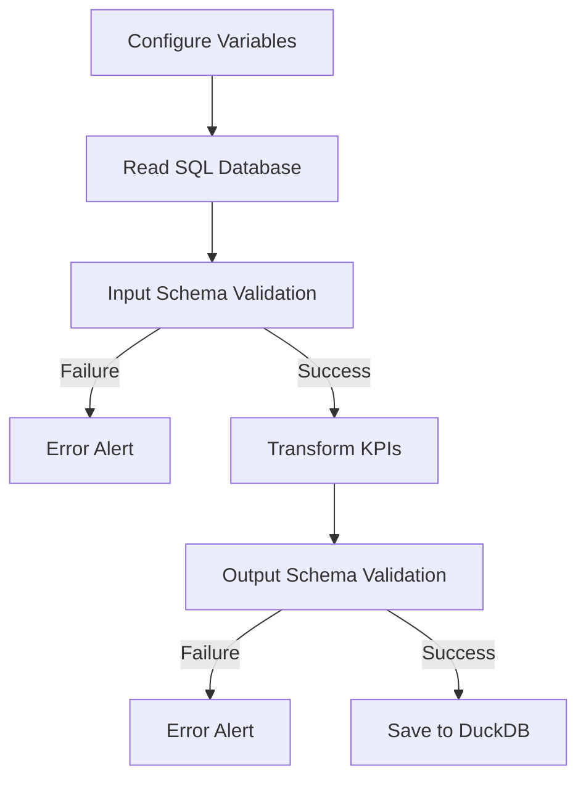

# Welcome to MkDocs

## Challenge 1 Billions rows Workflow

- In order to develop the ETL we are going to develop the following use case

```mermaid
graph TD
    A[Configure Variables] --> B[Read SQL Database]
    B --> C[Input Schema Validation]
    
    C -- Failure --> D[Error Alert]
    C -- Success --> E[Transform KPIs]
    
    E --> F[Output Schema Validation]
    
    F -- Failure --> G[Error Alert]
    F -- Success --> H[Save to DuckDB]
```